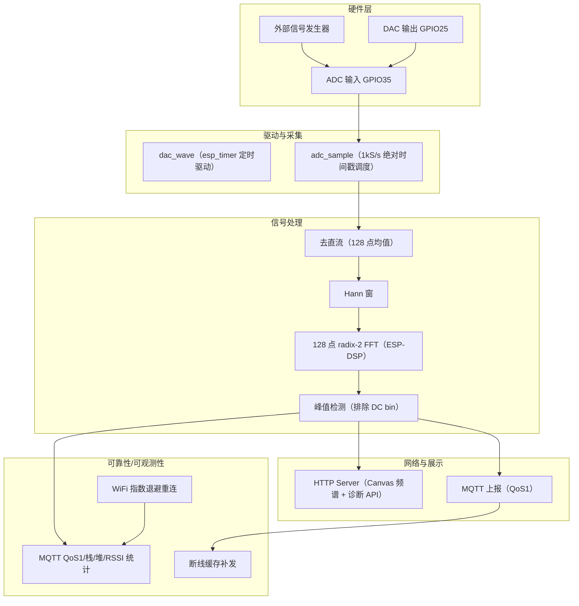
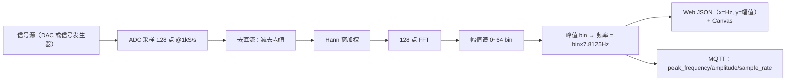
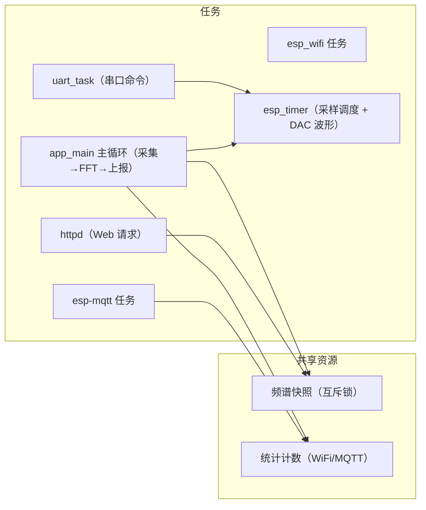
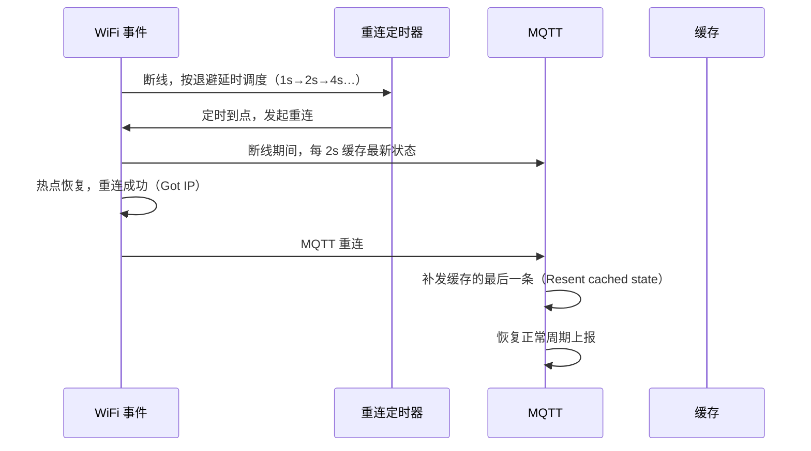

# ESP32 信号处理系统 系统框图与数据流图

## 1. 系统架构框图

## 2. 信号数据流图

## 3. 任务与并发模型

## 4. 可靠性机制时序（断网→恢复）

## 5. 说明

- 全部共享数据（频谱快照、统计计数）通过互斥锁保护，避免跨任务数据竞争。
- Web 频谱与诊断接口（`/api/status`、`/api/metrics`）复用同一锁。
- DAC 波形由 esp_timer 驱动（真机测试修复），不占用任务 CPU。
